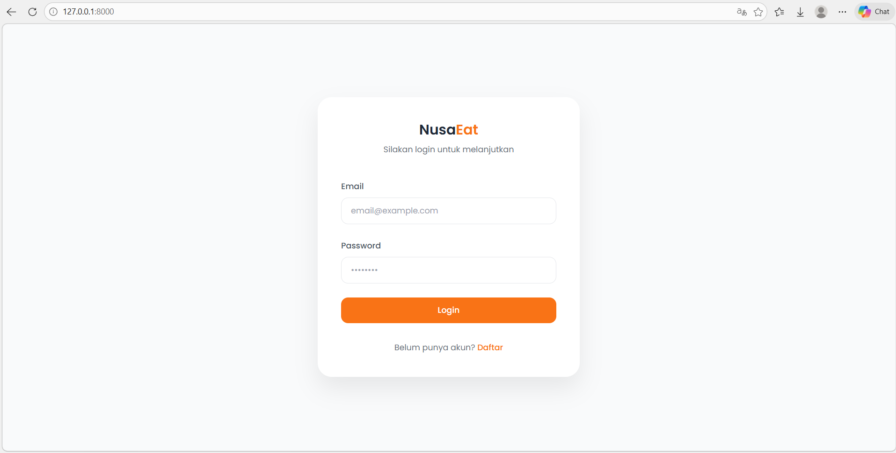

## 🌿 PesanMakan adalah aplikasi berbasis web yang dibuat untuk memudahkan proses pemesanan makanan secara online. Aplikasi ini memiliki dua peran utama, yaitu Admin dan User, yang masing-masing memiliki fitur dan akses berbeda sesuai kebutuhan.
Proyek ini dirancang untuk mensimulasikan sistem pemesanan makanan modern, mulai dari pengelolaan menu hingga interaksi langsung antara pengguna dan admin.

**Visi:** Menjadi platform digital edukatif dan terpercaya dalam mendukung pelestarian keanekaragaman hayati hutan lindung melalui dokumentasi dan partisipasi masyarakat.

---

## 📸 Dokumentasi Antarmuka

### 1. Halaman Login

### 2. Role: User
User memiliki akses untuk berinteraksi dengan menu dan layanan.
* 
* 
* 
* 

**Fitur User:**
* Menjelajahi daftar menu makanan dan minuman.
* Melakukan pemesanan secara real-time.
* Fitur Chat langsung ke Admin untuk konsultasi menu.
* Tracking status pesanan.

### 3. Role: Admin
Panel kendali utama untuk operasional bisnis.
* 
* 
* 
* 

**Fitur Admin:**
* Manajemen CRUD (Create, Read, Update, Delete) data menu.
* Monitoring dan manajemen status pesanan user.
* Sistem layanan pelanggan melalui chat.
---

---

## 🛠️ Teknologi yang Digunakan
* **Framework:** [Laravel](https://laravel.com)
* **Database:** MySQL

---

## 👩‍💻 Tim Pengembang
Proyek ini dikembangkan oleh:
* **dwi sasta cecilia**

---

© 2026 pesan makan

