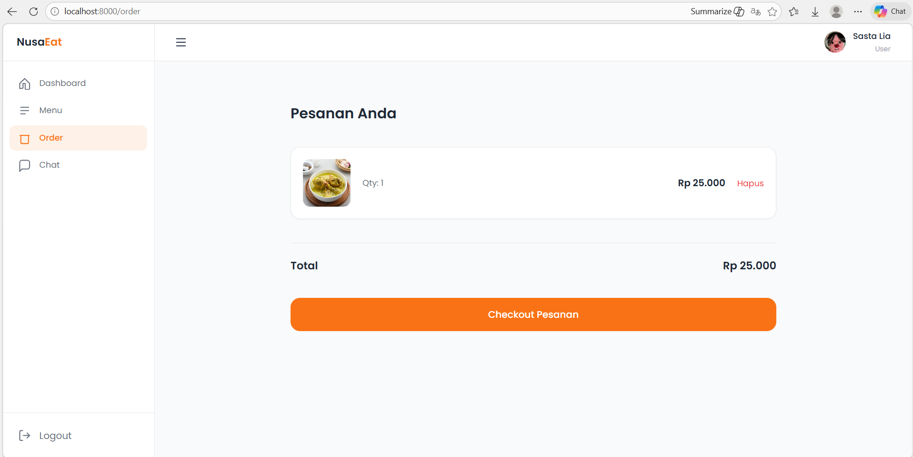
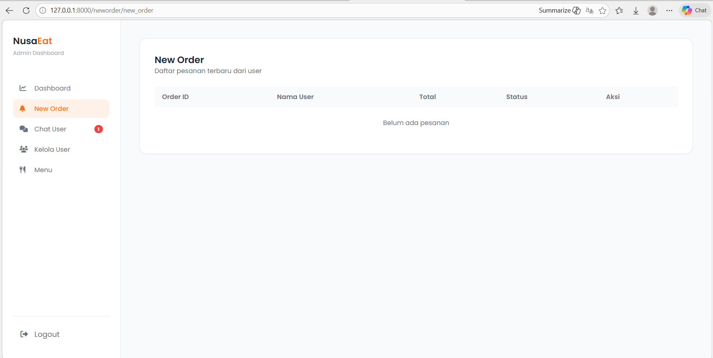
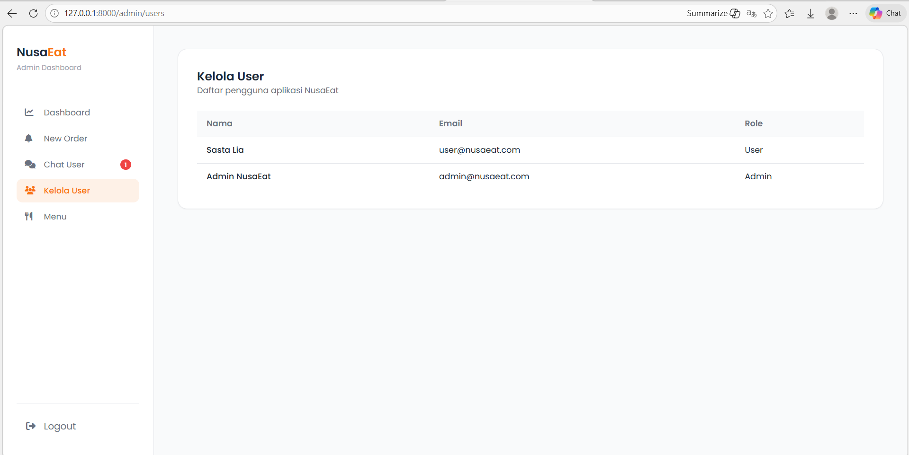
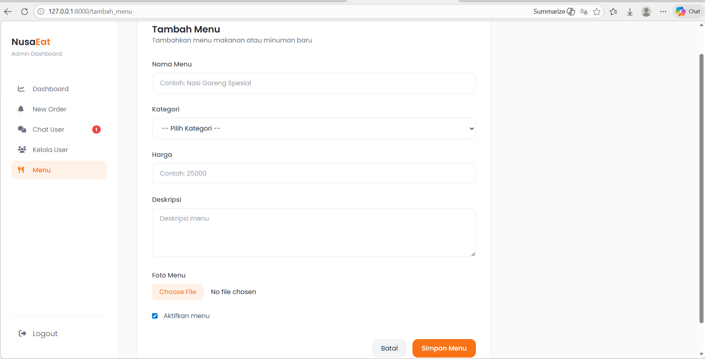

## 🌿 PesanMakan adalah aplikasi berbasis web yang dibuat untuk memudahkan proses pemesanan makanan secara online. Aplikasi ini memiliki dua peran utama, yaitu Admin dan User, yang masing-masing memiliki fitur dan akses berbeda sesuai kebutuhan.
Proyek ini dirancang untuk mensimulasikan sistem pemesanan makanan modern, mulai dari pengelolaan menu hingga interaksi langsung antara pengguna dan admin.

**Visi:** Menjadi platform digital edukatif dan terpercaya dalam mendukung pelestarian keanekaragaman hayati hutan lindung melalui dokumentasi dan partisipasi masyarakat.

---

## 👥 Hak Akses (Roles)
Aplikasi ini memiliki tiga hak akses utama dengan fungsi yang berbeda:
1. **Public:** Masyarakat umum yang dapat menjelajahi katalog flora dan fauna.
2. **user:** Kontributor yang memiliki akses untuk mengusulkan data flora atau fauna baru.
3. **Admin Dashboard:** Pengelola sistem yang memiliki otoritas penuh untuk validasi data, kelola anggota, dan pengaturan sistem.

---

## 📸 Dokumentasi Antarmuka (Landing Page & Dashboard)

### 1. Role: Public (Landing Page Utama)
Halaman depan yang menampilkan katalog publik dan informasi umum BioSave.

### 2. Role: User
Halaman khusus bagi kontributor untuk melakukan pengajuan data flora/fauna.

![User Page 2]psnmkn/menu user.png)

User dapat melakukan beberapa fungsi, yaitu:
* **Dashboard Kontributor:** Melihat statistik berapa banyak data yang sudah Anda ajukan.
* **Riwayat Pengajuan:** Melacak apakah data Anda sudah disetujui (Approved) atau masih ditinjau (Pending).
* **Edit Profil:** Memperbarui informasi biodata kontributor.

### 3. Role: Admin (Dashboard)
Panel kendali utama untuk manajemen konten dan user.

---

---

## 🛠️ Teknologi yang Digunakan
* **Framework:** [Laravel](https://laravel.com)
* **Database:** MySQL

---

## 👩‍💻 Tim Pengembang
Proyek ini dikembangkan oleh:
* **dwi sasta cecilia**

---

© 2026 pesan makan

